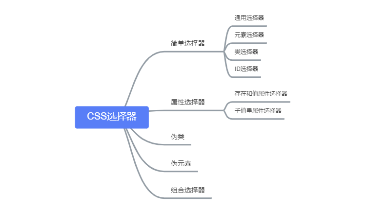

# CSS选择器及优先级

## 选择器

* https://developer.mozilla.org/zh-CN/docs/Learn/CSS/Introduction_to_CSS/Selectors

<div style="text-align: center;"></div>

### 简单选择器

* `*`通用选择器

```CSS
* { background-color: rgba(255,0,0,.2); }
* * { background-color: rgba(0,255,0,.2); }
* * * { background-color: rgba(0,0,255,.2); }
* * * * { background-color: rgba(255,0,255,.2); }
* * * * * { background-color: rgba(0,255,255,.2); }
* * * * * * { background-color: rgba(255,255,0,.2); }
```

* 元素选择器

```CSS
p {
    color: red;
}

h1 {
    color: blue;
}
```

* 类选择器

```CSS
.xxx {
    background: rgb(0,234,32);
}
```

* ID选择器

```CSS
#btn {
    padding: 4px;
}
```

### 属性选择器

* **存在和值（Presence and value）属性选择器节**，这些属性选择器尝试匹配精确的属性值：
  * `[attr]`：该选择器选择包含 attr 属性的所有元素，不论 attr 的值为何。
  * `[attr=val]`：该选择器仅选择 attr 属性被赋值为 val 的所有元素。
  * `[attr~=val]`：该选择器仅选择具有 attr 属性的元素，而且要求 val 值是 attr 值包含的被空格分隔的取值列表里中的一个。

* **子串值（Substring value）属性选择器节**，也被称为“伪正则选择器”，因为它们提供类似正则表达式的灵活匹配方式：
  * `[attr|=val]` : 选择attr属性的值是 val 或值以 val- 开头的元素。（只等于var）
  * `[attr^=val]` : 选择attr属性的值以 val 开头（包括 val）的元素。
  * `[attr$=val]` : 选择attr属性的值以 val 结尾（包括 val）的元素。
  * `[attr*=val]` : 选择attr属性的值中包含子字符串 val 的元素（一个子字符串就是一个字符串的一部分而已，如，"cat" 是 字符串 "caterpillar" 的子字符串）。

```CSS
/* 包含 title 属性的子元素 */
div [title] {
  color: blue;
}

/* i表示忽略大小写 */
div[title*="abc" i] {
  color: red;
}

/* 根据输入框类型设置样式 */
input[type="email"] {
  color: papayawhip;
}
input[type="tel"] {
  color: thistle;
}

/* 改变下载标签的icon */
a[download][href$="pdf"]:after {
  content: url(pdf-icon.svg);
}
```

### 伪类

https://developer.mozilla.org/zh-CN/docs/Web/CSS/Pseudo-classes

- 常见的伪类:
    - `link`,`:visited`,`:focus`,`:hover`,`:active`
    - `:nth-child()`,`:nth-of-type()`
    - `:root`,`:not()`,`:empty`,`:target`

```CSS
li:first-child {
    color: orange;
}
```

### 伪元素

https://developer.mozilla.org/en-US/docs/Web/CSS/Pseudo-elements

- [`::after`](https://developer.mozilla.org/zh-CN/docs/Web/CSS/::after)
- [`::before`](https://developer.mozilla.org/zh-CN/docs/Web/CSS/::before)
- [`::first-letter`](https://developer.mozilla.org/zh-CN/docs/Web/CSS/::first-letter)
- [`::first-line`](https://developer.mozilla.org/zh-CN/docs/Web/CSS/::first-line)
- [`::selection`](https://developer.mozilla.org/zh-CN/docs/Web/CSS/::selection)
- [`::backdrop`](https://developer.mozilla.org/zh-CN/docs/Web/CSS/::backdrop)

* 单冒号`:`用于 CSS3 伪类，双冒号`::`用于 CSS3 伪元素。对于 CSS2 中已经有的伪元素，例如`:before`，单冒号和双冒号的写法`::before` 作用是一样的。

```CSS
/* 利用伪元素清除浮动 */
.clearfix::after {
    content: '';
    display: block;
    clear: both;
}

/* 给内联元素实现换行 */
.inline-element::after {
  content:"\A";
  white-space: pre;
}
```

### 组合选择器

* 选择器组：  `A,B` 匹配满足A（和/或）B的任意元素。
* 后代选择器：`A B` 匹配B元素，满足条件：B是A的后代结点（B是A的子节点，或者A的子节点的子节点）
* 子选择器：  `A > B` 匹配B元素，满足条件：B是A的直接子节点
* 相邻兄弟选择器：`A + B` 匹配B元素，满足条件：B是A的下一个兄弟节点（AB有相同的父结点，并且B紧跟在A的后面）
* 通用兄弟选择器：`A ~ B` 匹配B元素，满足条件：B是A之后的兄弟节点中的任意一个（AB有相同的父节点，B在A之后，但不一定是紧挨着A）

## 优先级

- http://www.ayqy.net/doc/css2-1/cascade.html#cascade
- https://developer.mozilla.org/zh-CN/docs/Learn/CSS/Introduction_to_CSS/Cascade_and_inheritance

- 一个选择器具有的专用性的量是用四种不同的值（或组件）来衡量的，它们可以被认为是千位，百位，十位和个位——在四个列中的四个简单数字：
    - 千位：如果声明是在`style`属性中该列加1分（这样的声明没有选择器，所以它们的专用性总是1000。）否则为0。
    - 百位：在整个选择器中每包含一个ID选择器就在该列中加1分。
    - 十位：在整个选择器中每包含一个类选择器、属性选择器、或者伪类就在该列中加1分。
    - 个位：在整个选择器中每包含一个元素选择器或伪元素就在该列中加1分。